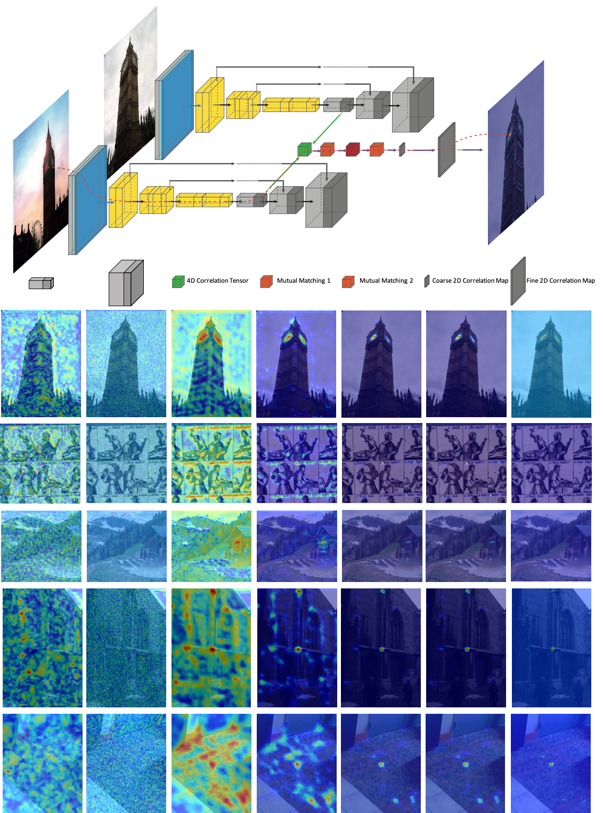

# X Resolution Correspondence Networks

## Bibtex

If you consider using our code/data please consider citing us as follows:

```
@inproceedings{tinchev2020xrcnet, 
    title={{$\mathbb{X}$}Resolution Correspondence Networks}, 
    author={Tinchev, Georgi and Li, Shuda and Han, Kai and Mitchell, David and Kouskouridas, Rigas}, 
    booktitle={arXiv preprint arXiv:2012.09842},
    year={2020} 
}

```


## Dependency
1. Install [conda](https://docs.conda.io/projects/conda/en/latest/user-guide/install/index.html)

2. Run:
```
conda env create --name <environment_name> --file asset/xrcnet.txt
```
To activate the environment, run
```
conda activate xrcnet
```
## Preparing data
We train our model on [MegaDepth](https://www.cs.cornell.edu/projects/megadepth/) dataset. To prepare for the data, you need
to download the **MegaDepth SfM models** from the [MegaDepth](https://www.cs.cornell.edu/projects/megadepth/) website and 
download `training_pairs.txt` from [here](http://xrcnet-data.s3.amazonaws.com/training_pairs.txt) and `validation_pairs.txt` from [here](http://xrcnet-data.s3.amazonaws.com/validation_pairs.txt).

## Training
1. After downloading the training data, edit the `config/train.sh` file to specify the dataset location and path to validation and training pairs.txt file that you downloaded from above
2. Run:
```
cd config;
bash train.sh -g <gpu_id> -c configs/xrcnet.json
```

## Pre-trained model
We also provide our pre-trained model. You can download `xrcnet.pth.tar` from [here](http://xrcnet-data.s3.amazonaws.com/xrcnet.pth)
and place it under the directory `trained_models`.

## Evaluation on HPatches
The dataset can be downloaded from [HPatches](https://github.com/hpatches/hpatches-dataset) repo. You need to download 
**HPatches full sequences**.\
After downloading the dataset, then:
1. Browse to `HPatches/`
2. Run `python eval_hpatches.py --checkpoint path/to/model --root path/to/parent/directory/of/hpatches_sequences`. This will
generate a text file which stores the result in current directory.
3. Open `draw_graph.py`. Change relevent path accordingly and run the script to draw the result.

We provide results of XRCNet alongside with other baseline methods in directory `cache-top`.

## Evaluation on InLoc
In order to run the InLoc evaluation, you first need to clone the [InLoc demo repo](https://github.com/HajimeTaira/InLoc_demo), and download and compile all the required depedencies. Then:

1. Browse to `inloc/`. 
2. Run `python eval_inloc_extract.py` adjusting the checkpoint and experiment name.
This will generate a series of matches files in the `inloc/matches/` directory that then need to be fed to the InLoc evaluation Matlab code. 
3. Modify the `inloc/eval_inloc_compute_poses.m` file provided to indicate the path of the InLoc demo repo, and the name of the experiment (the particular directory name inside `inloc/matches/`), and run it using Matlab.
4. Use the `inloc/eval_inloc_generate_plot.m` file to plot the results from shortlist file generated in the previous stage: `/your_path_to/InLoc_demo_old/experiment_name/shortlist_densePV.mat`. Precomputed shortlist files are provided in `inloc/shortlist`.

## Evaluation on Aachen Day-Night
In order to run the Aachen Day-Night evaluation, you first need to clone the [Visualization benchmark repo](https://github.com/tsattler/visuallocalizationbenchmark), and download and compile [all the required depedencies](https://github.com/tsattler/visuallocalizationbenchmark/tree/master/local_feature_evaluation) (note that you'll need to compile Colmap if you have not done so yet). Then:

1. Browse to `aachen_day_and_night/`. 
2. Run `python eval_aachen_extract.py` adjusting the checkpoint and experiment name.
3. Copy the `eval_aachen_reconstruct.py` file to `visuallocalizationbenchmark/local_feature_evaluation` and run it in the following way:

```
python eval_aachen_reconstruct.py 
	--dataset_path /path_to_aachen/aachen 
	--colmap_path /local/colmap/build/src/exe
	--method_name experiment_name
```
4. Upload the file `/path_to_aachen/aachen/Aachen_eval_[experiment_name].txt` to `https://www.visuallocalization.net/` to get the results on this benchmark.

## Acknowledgement
Our code is based on the code provided by [DualRCNet](https://dualrcnet.active.vision/), [NCNet](https://www.di.ens.fr/willow/research/ncnet/), [Sparse-NCNet](https://www.di.ens.fr/willow/research/sparse-ncnet/), and [ANC-Net](https://ancnet.active.vision/).
